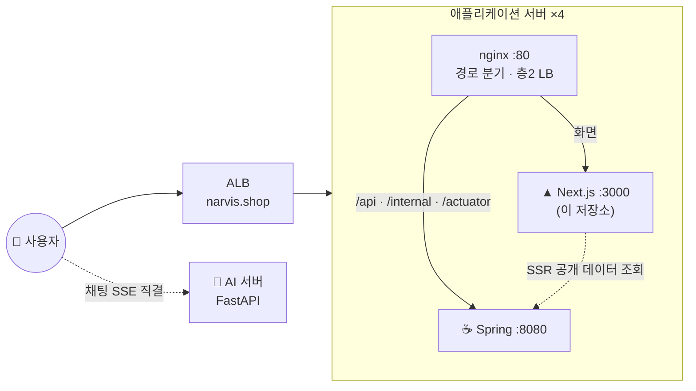

# 🛍️ NARVIS — 에이전틱 커머스 프론트엔드

> 대화로 상품을 찾고 담고 사는 **에이전틱 커머스(Agentic Commerce)** 서비스의 웹 클라이언트.
> 사용자가 보는 모든 화면과, AI가 대신 수행한 행위를 화면에 반영하는 실시간 스트림 처리를 담당한다.

<p>
  
  
  
  
  
  
</p>

---

## 📌 프로젝트 개요

서비스는 세 저장소로 나뉘며, 이 저장소는 **사용자가 실제로 만지는 화면 전부**를 담당한다.

| 역할 | 담당 |
|---|---|
| **프론트엔드 (이 저장소)** | 구매자·판매자 화면 24개 라우트, 채팅 UI, SSE 스트림 소비, 인증 흐름, 앱 티어 nginx |
| 백엔드 | 인증·권한, 상품·장바구니·주문, 커머스 원본 데이터 소유 |
| AI 서버 | 대화형 추천·장바구니 에이전트, 판매자 분석 챗봇, 개인화 프로필 |

**화면의 원칙은 "AI가 한 일도 사용자가 한 일과 같게 보인다"** 다. 챗봇이 장바구니에 담으면
헤더 배지와 장바구니 화면이 즉시 갱신되고, 실패하면 사용자가 직접 눌렀을 때와 같은 문구로
알린다. 화면은 AI를 특별 취급하지 않고, 같은 캐시·같은 무효화 경로를 쓴다.

### 핵심 기능

- 💬 **대화형 쇼핑** — 자연어 채팅으로 상품 탐색, 조건 칩을 눌러 필터를 빼거나 완화, 단계별 진행 상황 표시
- 🛒 **비로그인 쇼핑** — 게스트도 탐색·챗봇·장바구니 담기까지. 로그인하면 담아둔 것이 그대로 승계된다
- 🔐 **쿠키 기반 인증** — 토큰을 JS가 보지 않는다. 새로고침 복원, 만료 자동 재발급, 역할별(구매자·판매자) 가드
- 📊 **판매자 챗봇** — 매출·통계 질문에 리포트 패널로 답하고, 상품 수정은 초안을 띄워 사람이 확정(HITL)
- 🧠 **취향 프로필** — AI가 쌓은 개인 취향을 방사형 그래프로 시각화
- 📱 **모바일 우선 반응형** — 360px부터 데스크탑까지 같은 코드로 대응

---

## 🏗️ 시스템 구성



- **프론트 컨테이너 안에 nginx와 Next가 함께 돈다.** Next는 `127.0.0.1:3000`만 바인딩하고, 외부에 열린 포트는 nginx의 80뿐이다.
- **API는 같은 오리진으로 나간다** — nginx가 `/api`를 백엔드로 넘겨 CORS와 쿠키 문제를 없앤다. 로컬에는 nginx가 없어 `src/app/api/[...path]/route.ts`가 그 역할을 대신한다.
- **채팅 스트림만 예외** — SSE는 nginx도 Next도 타지 않고 브라우저가 AI 서버를 직접 부른다. 세션 발급 응답으로 받은 절대 URL에 `fetch`로 붙는다(POST + body라 `EventSource`를 쓸 수 없다).

---

## 🧰 기술 스택 & 선택 이유

| 영역 | 기술 | 선택 이유 |
|---|---|---|
| 프레임워크 | **Next.js 16 (App Router)** | 공개 페이지(홈·상품 상세·브랜드)만 서버에서 렌더해 검색 노출과 첫 화면 속도를 얻고, 인증이 필요한 화면은 클라이언트 기준을 유지 |
| 언어 | **TypeScript 5** | 백엔드·AI와 맞춘 계약 필드가 그대로 타입이 된다. `any` 금지 |
| 서버 상태 | **React Query 5** | 서버 원본 데이터의 주인을 캐시 하나로 고정. 화면마다 복제하지 않고 무효화로만 동기화해서, 챗봇이 바꾼 장바구니도 같은 경로로 반영된다 |
| 클라이언트 상태 | **Zustand** | 인증·현재 대화·UI 상태만 담는다. 서버 데이터와 섞이지 않게 역할을 좁혔다 |
| 폼 | **React Hook Form + Zod** | 검증 규칙을 스키마 한 곳에 두고 백엔드 필드 정의와 맞춘다 |
| 스타일 | **Tailwind v4 + shadcn/ui** | 색·라운드·간격을 토큰으로 고정해 1인 개발에서도 화면 간 편차가 생기지 않게 한다 |
| HTTP | **axios** | 인터셉터 한 곳에 인증 재발급 규약을 모아, 화면 코드가 401을 몰라도 되게 한다 |
| 테스트 | **Vitest** | 스트림 파싱·재시도·조건 칩 계산 같은 순수 로직만 빠르게 고정(233건) |
| 배포 | **Docker (nginx + node)** | 앱 티어의 경로 분기를 프론트 컨테이너가 겸한다 |

---

## 💡 주요 기술적 도전 & 설계 결정

1. **상품 카드를 스트림에 싣지 않는다** — AI가 고른 목록의 식별자만 받고, 가격·이미지·재고는 백엔드에서 따로 조회한다. 표시 데이터의 권위를 한 곳에 두기 위해서다. 조회한 카드는 상세 화면 캐시에 그대로 넘겨 재조회를 없앴다.
2. **토큰이 쿠키가 되자 "로그인했는가"를 물을 수 없게 됐다** — JS가 토큰을 못 읽으니 화면이 스스로 판정할 수단이 사라진다. 대신 *복원이 끝났고 사용자 정보가 있는가*를 유일한 준비 신호로 정의했다. 이 신호 없이 조회를 시작하면 만료된 토큰으로 요청이 나가 재발급이 폭주한다.
3. **401을 두 종류로 나눴다** — "만료됐으니 다시 발급받아라"와 "애초에 권한이 없다"를 코드로 구분한다. 상태 코드만 보고 분기하면 게스트가 배경 요청 한 번에 로그인 화면으로 튕긴다. 행동 수집처럼 사용자가 시작하지 않은 요청은 이 경로 자체를 공유하지 않는다.
4. **서버에서 렌더한 데이터를 캐시에 넣을 때의 함정** — 서버가 만든 초기값을 모든 조회 키에 넣었더니, 필터를 바꿔 새 키가 생긴 순간에도 옛 데이터가 초기값으로 들어가고 신선도 설정 때문에 **재조회조차 하지 않았다.** 이후로 초기값은 "서버가 실제로 렌더한 그 조합"에만 준다.
5. **URL 쿼리를 읽었더니 SSR이 죽었다** — 쿼리 파라미터를 읽는 훅은 그 경계 전체를 서버 렌더에서 빈 HTML로 만든다. 페이지를 통째로 감싼 탓에 로그인 화면이 9KB짜리 껍데기로 나갔다. 지금은 *렌더에 필요한가, 클릭 시점에만 필요한가*를 먼저 따져 경계를 최소로 좁힌다.
6. **대화는 탭 단위로만 살린다** — 서버의 대화 맥락이 10분 만에 사라지므로 그보다 오래 남기면 화면엔 대화가 있는데 AI는 기억 못 하는 상태가 길어진다. 탭 수명이 그 간극을 가장 작게 만든다.

---

## 📂 프로젝트 구조

**같이 수정될 것을 같이 둔다.** 페이지 전용은 페이지 폴더에 두고, 두 곳 이상이 쓰기 시작한 순간에만 `shared`로 올린다.

```
src/
├── app/                      # 라우트(App Router) — 화면 구현은 담지 않고 features를 조합만 한다
│   ├── (홈 · products · brands · chat · cart · checkout · login · signup)
│   ├── mypage/               # 주문 · 클레임 · 배송지 · 후기 · 최근 본 · 찜 · 취향 프로필
│   ├── seller/               # 판매자 대시보드 · 주문 · 상품 · 분석 챗봇
│   └── api/[...path]/        # 로컬 개발 전용 백엔드 프록시 (배포에서는 nginx가 처리)
├── features/<page>/          # 페이지 화면 구현 (components · hooks · utils)
└── shared/
    ├── chat/                 # 챗봇 공통 모듈 — 스트림 파싱 · 세션 · 조건 칩 · 액션 반영
    ├── api/                  # axios 클라이언트(인증 규약) · 서버 전용 클라이언트
    ├── auth/                 # 라우트 가드 · 세션 복원 · 재발급
    ├── stores/ hooks/ types/ # 클라이언트 상태 · 공용 훅 · 계약 타입
    ├── analytics/            # 행동 이벤트 수집 (사용자 흐름과 분리된 배경 전송)
    └── ui/                   # 도메인을 모르는 순수 UI 부품

docs/                         # 구조 · 계약 · 사건 기록 (docs/README.md가 색인)
nginx.conf · Dockerfile       # 앱 티어 경로 분기 · 배포 이미지
```

챗봇 2종(상품 추천 / 판매자 분석)은 **같은 채팅 API를 채널만 바꿔 공유**한다. 공통 모듈이 스트림과
세션을 맡고, 채널별로 다른 것은 렌더러만 주입한다.

---

## 🚀 시작하기

**사전 준비** — Node.js 20+, 그리고 로컬 백엔드(`localhost:8080`)

```bash
# 1. 의존성 설치
npm ci

# 2. 환경변수 (.env.example → .env.local 복사 후 채움)
cp .env.example .env.local

# 3. 개발 서버 — 포트 3000 고정 (백엔드 CORS가 이 주소만 허용한다)
npm run dev

# 4. 검증 — build가 진짜 게이트다 (타입 검사 포함, tsc만으로는 놓치는 에러가 있다)
npm run build
npm run lint
npm run test          # vitest 233건
```

배포 서버 https://narvis.shop 에서 바로 확인할 수 있다.
평가용 계정은 일반 사용자 `autumn@narvis.shop` / 판매자 `spring@narvis.shop` (비밀번호는 제출 문서 참조).

### 화면

| 그룹 | 경로 | 내용 |
|---|---|---|
| 홈·랜딩 | `/` · `/landing` | 개인화 추천·인기 상품, 서비스 소개 |
| 탐색 | `/products/[id]` · `/brands/[id]` | 상품 상세(옵션·후기), 브랜드 홈 — 서버 렌더 대상 |
| 채팅 | `/chat` | 대화형 상품 탐색 — 조건 칩·제안 칩·추천 카드 |
| 구매 | `/cart` · `/checkout` · `/checkout/complete` | 장바구니(게스트 허용) · 주문 · 모의 결제 |
| 마이페이지 | `/mypage/**` | 주문·클레임·배송지·후기·최근 본·찜·취향 프로필 |
| 판매자 | `/seller/**` | 대시보드·주문·상품 관리 + 분석 챗봇 |
| 인증·운영 | `/login` · `/signup` · `/healthz` | 로그인(복귀 URL 유지)·가입·헬스 체크 |

화면별 목적과 상세 기능은 [docs/features.md](docs/features.md).

### 환경변수

전체 설명은 [.env.example](.env.example).

| 변수 | 로컬 | 배포 | 설명 |
|---|---|---|---|
| `NEXT_PUBLIC_API_BASE_URL` | 비움(상대경로) | 비움 | 브라우저가 쓰는 API 주소. **빌드 시점에 번들에 박힌다** — 이미지 빌드 때 주입해야 한다 |
| `API_PROXY_TARGET` | `http://localhost:8080` | 컨테이너 내 백엔드 | 서버(프록시 핸들러)가 실제로 요청을 보낼 주소 |
| `SITE_URL` | 선택 | `https://narvis.shop` | Open Graph·canonical 등 절대 URL 메타데이터. 런타임에 읽으므로 실행 시점 주입으로 충분 |

---

## 🔀 Git 워크플로 & 규칙

**3단 브랜치** — `기능 브랜치 → dev → main`. 기능 브랜치는 변경 자체의 타당성을, `dev`는 합쳤을 때의
통합 여부를, `main`은 배포 가능 여부를 판단하는 지점이다. `main` push가 곧 운영 배포다.

| 브랜치 | 병합 시 동작 |
|---|---|
| `feat/*` `fix/*` `docs/*` `design/*` `chore/*` | Pull Request에서 lint + 프로덕션 빌드 실행 (빌드가 타입 검사를 겸한다) |
| `dev` | 통합 확인 지점 |
| `main` | 이미지 빌드 후 운영 서버 4대에 **2대씩 무중단 배포**, 기동 실패 시 직전 정상 이미지로 자동 되돌리기 |

- **프론트 컨테이너가 곧 nginx라 교체 중에는 그 서버의 80포트 전체가 죽는다.** 그래서 배포는 로드밸런서 대상그룹에서 인스턴스를 빼고 → 교체하고 → 헬스 체크 통과 후 되돌리는 순서로 돈다. 한 번에 2대까지만 교체해 항상 2대가 트래픽을 받는다.
- CI는 백엔드 없이도 통과해야 한다 — 서버 fetch에 5초 타임아웃이 걸려 있고 홈은 빌드 시점에 백엔드를 부르지 않는다.
- 커밋 메시지는 [Conventional Commits](https://www.conventionalcommits.org) (`feat:` `fix:` `docs:` `refactor:` `test:` `chore:`).
- 문서와 PR 본문은 **개조식(~함/~음)** 으로 쓴다.
- **계약·구조가 바뀌는 커밋은 [CLAUDE.md](CLAUDE.md)를 같이 고친다** — 문서가 구현보다 뒤처졌던 지점들을 정리한 이력이 [docs/README.md](docs/README.md)에 남아 있다.
- `.env.local`은 커밋하지 않는다(gitignore 확인).

---

## 📎 문서

| 문서 | 내용 |
|---|---|
| [docs/README.md](docs/README.md) | 문서 색인 — 상황별로 어디부터 볼지 |
| [docs/architecture-chat.md](docs/architecture-chat.md) | 채팅 구조 — 세 갈래 통신 경로 · SSE 이벤트 11종 · 카드 조회 · 세션/멀티탭 · 판매자 초안/리포트 |
| [docs/architecture-auth.md](docs/architecture-auth.md) | 인증 구조 — 쿠키 전환 이후 · 부팅 복원 · 401 2종 규약 · 가드 |
| [docs/architecture-data.md](docs/architecture-data.md) | 데이터 구조 — 쿼리 키 · 신선도 기준 · 무효화 · 서버 렌더 경계 |
| [docs/features.md](docs/features.md) | 화면별 목적과 핵심 기능 |
| [docs/deploy-handoff-nextjs.md](docs/deploy-handoff-nextjs.md) | 배포 인수인계 — nginx + node 2프로세스 구조 |
| [CLAUDE.md](CLAUDE.md) | 이 저장소의 작업 규칙 요약 (구조·상태·인증·디자인 토큰) |
</content>
